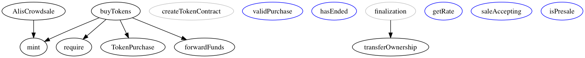

  
  
# Contracts

The ICO contracts of [ALIS project](https://alismedia.jp).  
Let me know from our social channels if you have any questions.  

# Solgraph
[Solgraph](https://github.com/raineorshine/solgraph) image of `AlisCrowdsale.sol`.  

# Prerequisite 
- node.js
    - See: `.node-version`
- yarn

# Usage

1. `git clone https://github.com/AlisProject/contracts.git`
1. `cd contracts`
1. `yarn`
1. `yarn truffle install`

# Test
- `yarn test:all`

## Run single test
- `yarn test ./test/alis_crowdsale.js`

# Debug
- `yarn debug`
    - You can use `debugger;` function of node.

# Linting
- `yarn lint`

# Deployment
You should adjust `gas` and `gasPrice` at `truffle.js`.

## Using private net(geth)
Prerequisite: geth, MIST or EtherumWallet.  
In case of MAC.

1. `cd config`
1. `mkdir datadir`
1. `geth init private.genesis.json --datadir ./datadir/`
1. Run private net.

        geth --datadir ./datadir --networkid 10 --ipcpath /Users/USERNAME/Library/Ethereum/geth.ipc \
        --rpc --rpcaddr "localhost" --rpcport "8545" --rpccorsdomain "*" --mine --minerthreads 4 --unlock 0,1 \
        console 2>> /tmp/geth.log

## Private net & Test net
- `yarn deploy`

## Main net
- `truffle deploy --network live`

# License
- [GPL-3.0](https://www.gnu.org/licenses/gpl-3.0.txt)
